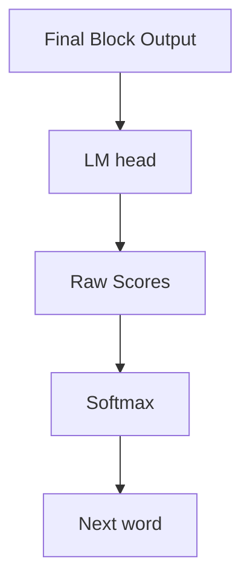

# Inside the Transformer:

We know that transformers stack multiple blocks to process text. But what is actually inside each block? The two main components:

- Attention looks at all words and decides which ones are relevant to each other.
- Feed-forward network processes each word's representation after attention has gathered context. It transforms the information but does not look at other words.

These two components repeat in every block. GPT-2 has 12 blocks, GPT-3 has 96 blocks, GPT-4 has even more. Each block refines the representation further.

## From blocks to prediction:

After the final transformer block, we need to convert representations into predictions. This comes to the output layer:

The LM head is a weight matrix that converts each word's final representation into a score for every word in the vocabulary. If the vocab has 10000 words, it produces 10000 scores.

Softmax converts the raw scores into probabilities that sum to 1. The word with the highest probability becomes the prediction.

We will build the model with less vocabulary, less embeddings, less head attentions and onlt around 3 blocks of transformer.