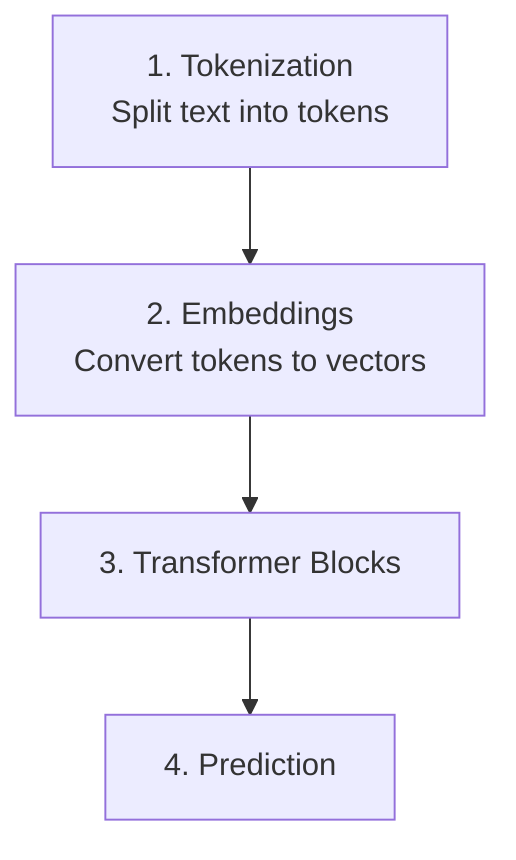
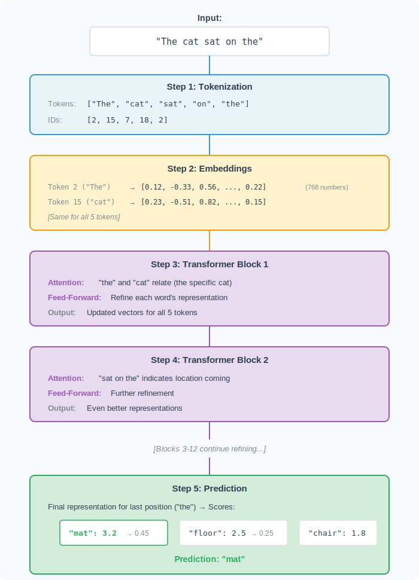

# The Transformer:

## How does the prediction actually work?

We know that LLMs predict the next word by assigning the probabilities to every word in the vocabulary. We type "The cat sat on the" and the model predicts the "mat" with high probability. But how does the model from text input to these probability scores?

The answer is the transformer architecture. This is the blueprint that defines how ChatGPT, Claude processes text. The transformer is a specfic design - a pipeline mathematical operations that converts text into predictions.

## Transformer Pipeline:

The transformer processes text through a sequence of transformations. Each transformation refines the representation until the model can make accurate predictions.



This pipeline runs every time you ask the model to predict the next word. The same architecture, and same sequence of steps.

## Breaking the components:

Each stage in the pipeline serves specific purpose. Understanding what each component does helps you see why it works:

- Tokenization breaks the text into pieces that model can process. Each token has numeric ID. This converts the text (which computers cannot process) into numbers (which they can).
- Embeddings convert token IDs into vector, a list of numbers that capture the meaning. Token ID like 15 can be converted into vector like ```[0.15, 0.25, ...]``` with 768 dimensions. These numbers encode what the model learnt from the word during training.
- Transformer blocks are where the real work happens. The model stacks multiple blocks, where each contains two key operations:
    - Attention finds the relationship between words.
    - Feed-forward networks transform each word's representation based on its context. After attention gathers the information, the feed-forward network processes that information to refine understanding. 
- Prediction layer converts the final representations into probability scores for every word in the vocabulary. 



## Why this architectural works:

- Parallel processing: Unlike appoarches that process words one at a time, transformers process all word simultaneouly. The model looks at the entire sentence at once, compute the relationship in parallel.
- Context awareness: The attention mechanisms let each word incorporate information from every other word. 
- Stacking for depth: Multiple transformer blocks build hierarchical understanding. Each layer builds on the previous layers.
- Learned transformations: The model does not use hand-coded rules. It contains millions and billions of numbers that get adjusted during training. These numbers encode everything that model knows about language: grammar, facts, reasoning patterns.

## Architectural is Universal:

The transformer is not just for languages. The same design is used on:

- Vision models processing images by treating image patches as tokens.
- Code generation use transformers based on source code instead of natural language.
- Audio models process sounds by converting audio into token sequences.