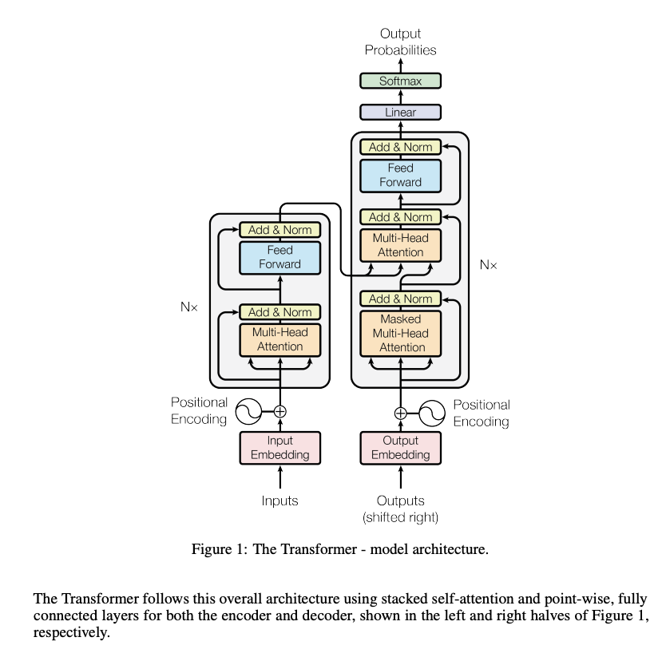

# Introduction:

Large language models are everywhere. ChatGPT, Claude can write code, answer questions, and generates contents. Every tech company is integrating AI into their products. LLMs have become the infrastructure, like databases and APIs.

However, most developers treat them as the black boxes - call the API and get the response. This creates the problem that if you do not understand how it works, you cannot debug it. When the API turns gibberish, you do not know why, when you need custom behavior, you are stuck.

Learning how LLMs actually changes everything. You understand why it hallucinates, why the temperature affects the randomness, why context length matters, and how to integrate them effectively in the system.

## Learning Problem:

Most LLM explanations assume machine learning knowledge. They are specified around terms like "self-attention", "learned positional encodings", and "gradient descent" without clear explanation. 

The most popular paper for the transformer architecture, which plays an important part in large language model is: ["Attention is All You Need"](https://arxiv.org/abs/1706.03762)



The explanation will be hard for people who read it for the first time. But it is actually broken into smaller parts:

```
Text to Numbers:

Text -> Tokenization > Embeddings

Output Layer:

embeddings -> LM Head -> Softmax -> predictions

Attention layer:

embeddings -> Attention -> LM Head -> Softmax

Complete Transformer Block:

embeddings -> Attention + Fast-Forward -> LM Head -> Softmax
```

## What is built:

In this course, we will build a a working language model from scratch - a minimal model that generates text. Ours model is tiny with around 20 words.

The model will have the same core building blocks as the GPT-4, scaled down to run in the browser only. The model includes 4-head attention, layer normalization, GELU activation, feed-forward networks, etc. Every component will be implemented using Numpy. We will not only understand how to use transformers, but how they work at a fundamental level.

## What the model learnt from:

**Pattern 1: Size Matching (Long-range dependencies)**

```
Training examples:
"the big cat sat on the big mat"
"the small dog ran to the small house"
"the big dog sat on the big mat"
"the small cat ran to the small house"
```

The model learned: big animals use the big objects, small animals use the small objects. This teaches attention to look back and remember "big: from 6 words earlier.

**Pattern 2: Color as Distraction**:

The model learned: color appears in the sentences but it does not affect the outcome. This teaches the attention to ignore irrelevant features.

**Pattern 3: Variety over repition (Context awareness)**:

The model learned: when coordinating with "and", prefer different animals. This teachs attention to track earlier mentions. 

These patterns are repeated during training until the model's weight matrices adjusted to predict them accurately. The attention heads specialized: some learn to focus on the size, others learn to ignore the color, and others learn to track the coordination. All these patterns are emerged from the data.

## Goal:

- **Reading research paper**: Better understand the "Attention is All You Need" paper. Every component will make sense.
- **Debug LLM applications**: When LLM repeats itself, we will know why. When the ouputs are incoherent, we will know what need to be adjusted. When the context limit is hit, we know the constraint.
- **Make informed decisions**: The model is chosen based on the purpose, not the marketing. We understand the trade-offs when running the model
- **Build better systems**: Optimize token usage by understanding tokenization. We will know how to write a better prompts by understanding the patter completion. 